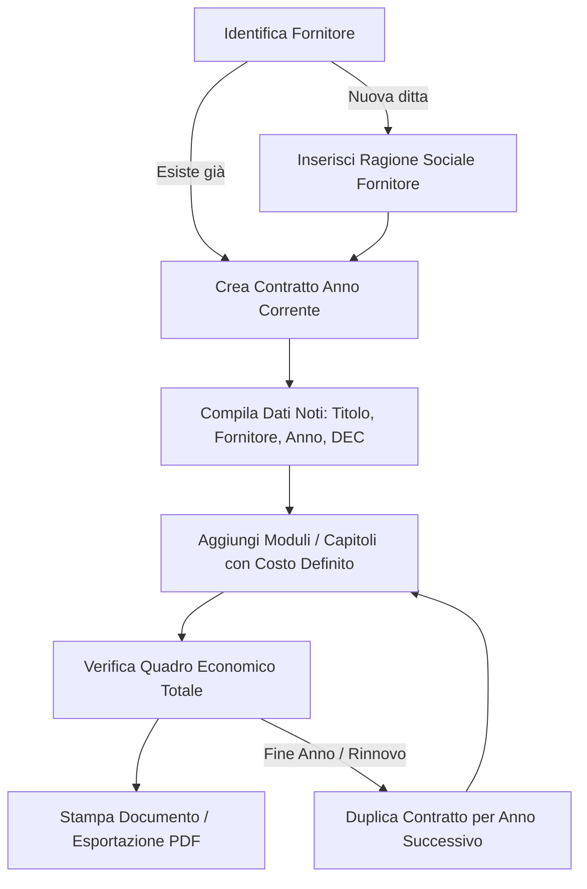

# Guida alla Gestione dei Contratti di Fornitura Servizi

Questa guida descrive il funzionamento, la struttura e le migliori pratiche operative per la gestione dei **Contratti di Fornitura e Manutenzione Annuali dei Servizi** all'interno dell'applicazione.

---

## 1. Panoramica del Modulo

Il modulo **Contratti** permette di censire e monitorare i contratti di manutenzione e fornitura dei servizi, tracciare i relativi costi, associare i fornitori e identificare il **DEC** (*Direttore dell'Esecuzione del Contratto*).

### Chi ha accesso al modulo:
* **Amministratori**: visualizzano e gestiscono tutti i contratti e le anagrafiche dei fornitori.
* **Responsabili di Reparto**: visualizzano e gestiscono i contratti associati al proprio reparto o gestiti da operatori appartenenti al reparto stesso.
* **Operatori con tag DEC**: gli operatori che hanno il tag `DEC` nel proprio profilo possono visualizzare e gestire i contratti di cui sono referenti o creatori.

---

## 2. Suggerimenti e Best Practice Operative

Per garantire una gestione snella, ordinata ed efficace dei contratti, si raccomanda di seguire queste linee guida:

### A. Inserire l'Anno in Corso e Usare la Funzione "Copia" per gli Anni Successivi
> [!TIP]
> **Consiglio Operativo**: Inserisci inizialmente i contratti relativi all'**anno in corso**, valorizzando i relativi capitoli di spesa (moduli).
>
> Quando dovrai predisporre i contratti per l'anno venturo, non occorre reinserire tutto da zero: utilizza il pulsante **"Copia per l'Anno Successivo"** (`Duplica Contratto`) presente nella scheda di dettaglio o nell'elenco. Il sistema clonerà automaticamente il contratto e **tutti i suoi moduli di fornitura**, aggiornando l'anno e il titolo. Potrai poi apportare solo i piccoli ritocchi necessari (es. eventuali variazioni tariffarie o di CIG/CUP).

### B. Compilare solo i Campi Conosciuti
> [!NOTE]
> Non è necessario reperire subito tutti i dati amministrativi per inserire un contratto.
>
> Compila **esclusivamente i campi noti** al momento dell'inserimento (ad esempio: *Titolo*, *Fornitore*, *Anno*). I codici formali come **CIG**, **CUP**, **Numero Contratto** o note integrative possono essere lasciati vuoti e compilati o aggiornati in qualsiasi momento successivo.

### C. Cosa sono i Moduli: Capitoli del Capitolato con Costo Definito
> [!IMPORTANT]
> I **Moduli di Fornitura** rappresentano i singoli **capitoli o servizi del capitolato di gara/fornitura che hanno un costo economico definito**.
>
> * **Cosa inserire come modulo**: Servizi a canone fisso/forfettario (es. *"Canone manutenzione licenze software annuali - € 4.500,00"*) oppure prestazioni a consumo/giornate (es. *"Supporto specialistico sistemistico - 20 giornate a 350,00 €/giorno"*).
> * **Cosa evitare**: **Evitare di inserire moduli puramente descrittivi a costo zero (€ 0,00)**. Se un capitolo del capitolato contiene clausole di servizio o descrizioni tecniche senza un importo economico autonomo, inserisci tali note nel campo descrittivo generale del contratto anziché creare un modulo vuoto. I moduli servono a comporre e valorizzare il **quadro economico complessivo**.

### D. Anagrafica Fornitori: Inserimento Rapido con Ragione Sociale
> [!TIP]
> Per inserire un nuovo fornitore non serve reperire subito l'intera scheda camerale.
>
> È sufficiente indicare anche **soltanto la Ragione Sociale** della ditta fornitrice. Tutti gli altri dettagli (Partita IVA, Codice Fiscale, PEC, email per gli ordini, numeri telefonici, referente commerciale/tecnico e indirizzo) possono essere aggiunti in seguito dall'anagrafica fornitori.

---

## 3. Flusso di Lavoro Operativo

### Passo 1: Creazione o Selezione del Fornitore
* Accedi a **Contratti** &rarr; **Nuovo Contratto** (o da **Fornitori** &rarr; **Nuovo Fornitore**).
* Seleziona il fornitore dal menu a tendina o creane uno al volo indicando almeno la Ragione Sociale.

### Passo 2: Dati Generali del Contratto
* Inserisci il **Titolo del contratto** (es. *"Manutenzione Sistemi e Infrastruttura di Rete 2026"*).
* Seleziona l'**Anno di competenza** (es. *2026*).
* Indica lo **Stato iniziale** (*Attivo*, *In definizione*, *Scaduto*, *Concluso*).
* Seleziona il **DEC** incaricato della supervisione e il **Reparto** di appartenenza.
* Inserisci eventuali codici noti (**CIG**, **CUP**, **Numero Documento**).

### Passo 3: Inserimento Moduli di Spesa / Capitoli del Capitolato
Dalla scheda di dettaglio del contratto:
1. Clicca su **"Aggiungi Modulo"**.
2. Specifica la **Descrizione del capitolo di fornitura** (es. *"Assistenza On-Site su Chiamata"*).
3. Opzionalmente collega una tipologia di servizio a catalogo.
4. Definisci l'importo economico:
   * **A tariffa oraria/giornaliera**: inserisci il numero di giornate stimate e il costo unitario giornaliero (il totale viene calcolato automaticamente).
   * **A canone fisso forfettario**: inserisci direttamente il costo totale della voce.

### Passo 4: Monitoraggio e Riepilogo Economico
La scheda di dettaglio del contratto riepiloga automaticamente:
* **Importo Totale Impegnato (€)** (somma dei moduli).
* **Totale Giornate Previste**.
* **Scheda Fornitore** con contatti diretti di escalation e PEC.
* **Badge di Stato** del contratto.

### Passo 5: Stampa del Contratto
Cliccando su **"Stampa Scheda"** si ottiene una versione pulita, priva di elementi di navigazione, ideale per:
* Archiviazione cartacea o salvataggio in PDF.
* Report per il DEC, la Direzione o gli uffici amministrativi.
* Raccolta firme formali tra DEC e Referente del Fornitore.

### Passo 6: Rinnovo per l'Anno Successivo (Duplicazione)
Quando si apre la nuova annualità:
1. Apri la scheda del contratto dell'anno precedente.
2. Clicca su **"Copia per Anno Successivo"** (icona con due fogli sovrapposti).
3. Conferma il nuovo anno di destinazione (proposto in automatico come anno successivo).
4. Il sistema clonerà il contratto e tutti i suoi capitoli/moduli di fornitura, pronti per essere utilizzati o adeguati.

---

## 4. Stati del Contratto

| Stato | Badge | Significato |
|---|:---:|---|
| **In Definizione** | Giallo | Contratto in fase di predisposizione o di negoziazione, non ancora esecutivo. |
| **Attivo** | Verde | Contratto in corso di validità ed esecuzione per l'annualità di riferimento. |
| **Scaduto** | Rosso | Annualità contrattuale terminata; è possibile rinnovare o archiviare. |
| **Concluso** | Grigio | Fornitura completata e chiusa regolarmente. |
