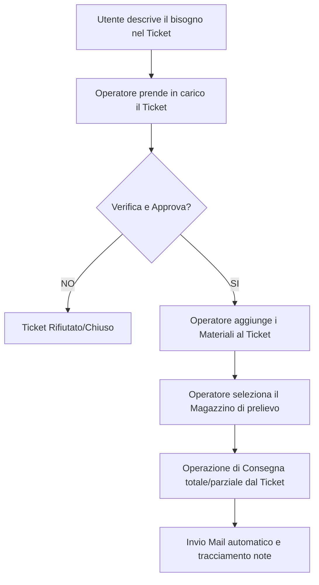

# Guida Operativa Funzioni di Magazzino e Logistica

Questa guida descrive in modo approfondito i flussi operativi, le responsabilità e le funzionalità del modulo **Magazzino & Logistica** di Troubletick.

---

## 📋 Indice
1. [Il Flusso Completo: Richiesta e Fornitura di Materiale](#1-il-flusso-completo-richiesta-e-fornitura-di-materiale)
2. [Gestione delle Richieste da parte del Magazziniere](#2-gestione-delle-richieste-da-parte-del-magazziniere)
3. [Operazioni di Scarico e Stampa Ricevute](#3-operazioni-di-scarico-e-stampa-ricevute)
4. [Carico e Scarico Diretto (Senza Ticket)](#4-carico-e-scarico-diretto-senza-ticket)
5. [Lo Scarico Multiplo (Carrello di Consegna)](#5-lo-scarico-multiplo-carrello-di-consegna)
6. [💡 Casi d'Uso Pratici ed Esempi](#6--casi-duso-pratici-ed-esempi)

---

## 1. Il Flusso Completo: Richiesta e Fornitura di Materiale
 
Il flusso standard di fornitura segue un processo strutturato per garantire tracciabilità e correttezza nelle assegnazioni e nelle giacenze:
 

 
### I Passaggi del Flusso:
 
1. **La Segnalazione Testuale**: Un utente descrive nel corpo di un ticket la necessità di materiale (es. *"La stampante al secondo piano ha finito il toner"* oppure *"Ho bisogno di una tastiera nuova"*).
2. **Presa in Carico**: L'operatore abilitato al servizio prende in carico la segnalazione e valuta la richiesta dell'utente.
3. **Pianificazione anche senza Giacenza**: Se la richiesta è valida, l'operatore clicca su **"Crea Nuova Richiesta"** all'interno della scheda di dettaglio del ticket per aggiungere i materiali necessari. **È possibile inserire i materiali richiesti anche se non sono attualmente disponibili a magazzino** (la richiesta rimarrà in stato *"In Attesa"* finché non viene effettuato un nuovo carico).
4. **Scelta del Magazzino**: Durante la creazione della richiesta, l'operatore seleziona il **magazzino di prelievo** più idoneo da cui dovrà essere prelevato l'articolo.
5. **Consegna Totale o Parziale in un unico passaggio**: Una volta approvati i materiali, l'operatore può cliccare direttamente su **"Procedi con consegna"** dal dettaglio del ticket. Questo apre lo scarico multiplo da cui è possibile procedere alla consegna di tutti i materiali pronti in un solo passaggio, oppure effettuare **consegne parziali** (lasciando i residui in attesa).
6. **Notifica Email di Avvenuta Consegna**: Quando viene registrato uno scarico (singolo o multiplo) legato alle richieste di un ticket, il sistema invia in automatico un'email di certificazione all'utente che ha aperto la segnalazione, e in copia conoscenza (Cc) a tutti gli operatori legati al servizio del ticket.
7. **Chiusura Vincolata del Ticket**: Il ticket non potrà essere chiuso finché rimangono richieste di materiale associate ad esso che non siano state ancora evase o annullate. I magazzinieri o gli operatori dovranno quindi evadere o annullare tutte le richieste pendenti per poter procedere alla chiusura.

---

## 2. Gestione delle Richieste da parte del Magazziniere

L'operatore di magazzino monitora costantemente le richieste in arrivo tramite il menu **Magazzino ➔ Richieste Materiale**:

* **Verifica della Coda**: La vista mostra le richieste filtrate in base ai magazzini a cui l'operatore è abilitato.
* **Controllo della Disponibilità**: 
  - Se il materiale richiesto è **disponibile** in giacenza, lo stato della richiesta passa automaticamente a **"Pronta per Scarico"** (evidenziato in giallo).
  - Se il materiale **non è disponibile**, la richiesta rimane nello stato **"In Attesa"** (evidenziato in azzurro) fino al carico di nuova merce.
* **Tempistica di Evasione**: Il magazziniere può cliccare su **"Esegui Scarico"** per confermare la fornitura del materiale. Questa operazione va eseguita **subito prima o immediatamente dopo** la consegna fisica del bene all'interessato.
* **Vincolo sulla Chiusura del Ticket**: Poiché la presenza di richieste in sospeso ("In Attesa" o "Pronta per Scarico") impedisce la chiusura del relativo ticket di supporto, l'operatore o il magazziniere devono completare l'evasione (o procedere all'annullamento delle richieste non più necessarie) per consentire la corretta chiusura della segnalazione.

---

## 3. Operazioni di Scarico e Stampa Ricevute

Quando si clicca su **"Esegui Scarico"** per una richiesta associata ad un ticket:

* **Campi Bloccati**: Per garantire la conformità con quanto inserito nella richiesta dall'operatore, la **quantità** e la **sede di destinazione** sono pre-compilate dalla richiesta e **non possono essere modificate**. Anche la spedizione/trasferimento ad altri magazzini è disabilitata.
* **Selezione Posizione**: Il magazziniere deve unicamente selezionare la **posizione fisica** (scaffale/lotto) da cui prelevare i pezzi.
* **Note Automatiche**: Il sistema imposta una descrizione predefinita e, ad operazione avvenuta, inserisce in automatico una nota di servizio nel ticket (es. *"Richiesta materiale evasa dal magazzino: 1x Toner HP"*).
* **Verbale di Consegna PDF**: Attivando la spunta **"Crea documento di consegna"** (posizionata all'interno del box **"Ricevente"**), il sistema apre una pagina di stampa ottimizzata in formato A4 che funge da verbale di consegna da far firmare al destinatario al ritiro del materiale.

---

## 4. Carico e Scarico Diretto (Senza Ticket)

Oltre al flusso controllato dai ticket di assistenza, Troubletick consente la gestione diretta della merce per operazioni logistiche di routine (es. inventari, rifornimenti, smaltimenti):

* **Carico Merce**: Dalla pagina **Inventario**, l'operatore clicca su **"Carico"** accanto ad un articolo per registrarne l'entrata. È obbligatorio specificare la quantità e la posizione fisica di stoccaggio. È caldamente consigliato allegare la foto del DDT o del bene.
* **Scarico Diretto**: Usando il tasto **"Scarico"** direttamente sull'inventario, si registra un prelievo manuale slegato dai ticket. Anche in questo caso è possibile generare il modulo di consegna PDF e indicare una sede aziendale di destinazione o avviare un **Trasferimento tra Magazzini** (spedizione tracciata che richiede l'approvazione del magazziniere di arrivo).

---

## 5. Lo Scarico Multiplo (Carrello di Consegna)
 
Nel caso in cui sia necessario scaricare più articoli contemporaneamente, si utilizza lo **Scarico Multiplo**. Questo modulo ha due modalità di funzionamento:
 
### A. Scarico Diretto (Senza Ticket)
1. Nella pagina **Inventario**, cliccare su **"Scarico Multiplo"** in alto.
2. Aggiungere le righe desiderate selezionando il magazzino, il materiale, la posizione di prelievo e la quantità.
3. Indicare la sede di destinazione, la data e una nota descrittiva unica.
4. Spuntare **"Genera PDF"** per produrre un **Buono di Consegna Cumulativo** che elenca tutti i materiali prelevati su un unico foglio, pronto per essere firmato.

### B. Consegna da Ticket ("Procedi con consegna")
1. All'interno del dettaglio del ticket, cliccare su **"Procedi con consegna"** (pulsante visibile solo se sono presenti richieste di materiale e il ticket è preso in carico).
2. Il modulo si apre personalizzando il titolo con il codice del ticket (es. *Consegna Materiale per Ticket #123456*), lasciando la lista articoli vuota per consentire all'operatore di popolarla.
3. In fondo alla pagina viene mostrata la tabella delle **Richieste Pendenti** (con le relative quantità da consegnare) per un riscontro immediato.
4. All'invio, il sistema esegue controlli rigorosi sia client-side che server-side:
   - Viene bloccato lo scarico di quantità superiori a quelle rimanenti da consegnare per il ticket.
   - Viene bloccato lo scarico di materiali che non sono presenti nelle richieste del ticket.
5. **Greedy Matching e Splitting**:
   - Il sistema associa in automatico gli articoli scaricati alle richieste pendenti, impostando lo stato a `evasa`.
   - Se un materiale viene consegnato parzialmente (es. richiesti 3 pezzi, consegnati 2), la richiesta originale viene aggiornata a 2 ed evasa, mentre viene generata in automatico una nuova richiesta pendente di 1 in stato `nuova` per il residuo.
   - Viene registrata una nota riepilogativa consolidata sul ticket.
   - Al completamento dello scarico, viene inviata l'email automatica di avvenuta consegna a utente e operatori in Cc.
 
---
 
## 💡 Casi d'Uso Pratici ed Esempi
 
### 🏢 Esempio 1: Allestimento Postazione Nuovo Dipendente (Flusso Standard con Ticket)
* **Scenario**: Le Risorse Umane aprono un ticket chiedendo la preparazione del materiale per un nuovo assunto presso la sede di Milano.
* **Operazione dell'Operatore Abilitato**: L'operatore IT abilitato al servizio prende in carico il ticket, verifica la richiesta e aggiunge formalmente ad esso tre richieste di materiale: 1x PC Desktop, 1x Monitor 24", 1x Kit Tastiera/Mouse, impostando come magazzino di prelievo "IT Milano".
* **Operazione del Magazziniere**: L'operatore del magazzino di Milano vede le tre richieste in stato "Pronta per scarico". Prepara il materiale, clicca su "Esegui Scarico" per ciascuno selezionando le rispettive posizioni fisiche, genera i PDF di consegna e fa firmare i fogli al dipendente al momento del ritiro.
 
### 📦 Esempio 2: Richiesta di Toner Esaurito (Gestione Pendenza/Backorder)
* **Scenario**: La segreteria di Alessandria segnala che la stampante multifunzione ha terminato il toner nero.
* **Operazione dell'Operatore Abilitato**: L'operatore abilitato inserisce la richiesta per 1x Toner Nero nel ticket, assegnando il prelievo al Magazzino Alessandria.
* **Operazione del Magazziniere (Richiesta Pendente)**: Il toner è esaurito nel magazzino di Alessandria. La richiesta compare nella lista in stato **"In Attesa"** (non è presente il tasto "Esegui Scarico").
* **Rifornimento**: Due giorni dopo, arriva il corriere con i nuovi toner. Il magazziniere effettua un **Carico** di 5 toner indicando la posizione `Scaffale B2`.
* **Evasione**: All'istante, la richiesta associata al ticket passa in stato **"Pronta per Scarico"**. Il magazziniere clicca su "Esegui Scarico", preleva 1 pezzo da `Scaffale B2` e consegna il toner. Una volta evasa questa richiesta, se non vi sono altri materiali pendenti, il ticket potrà finalmente essere chiuso.
 
### 🛠️ Esempio 3: Manutenzione Straordinaria (Scarico Diretto e Trasferimento)
* **Scenario**: Viene riscontrato che un componente di rete nel Magazzino Centrale deve essere spedito al Magazzino Secondario di Torino per sostituire un pezzo guasto.
* **Operazione**: Il responsabile logistica esegue uno **Scarico Diretto** dal Magazzino Centrale per l'articolo desiderato. Nella form di scarico, seleziona come destinazione **"OPPURE Trasferisci a Magazzino"** indicando "Magazzino Torino".
* **Regola di Ricezione in Blocco**: La giacenza nel Magazzino Centrale decresce immediatamente. Il sistema crea una spedizione in stato "In Consegna". Quando il pacco arriva a Torino, il magazziniere locale va su "Trasferimenti" per verificarlo. **Tra magazzini, la quantità spedita deve essere scaricata/caricata in blocco dal destinatario (non sono consentite ricezioni parziali)**. Se l'arrivo rispetta le quantità inviate, il magazziniere clicca su "Ricevi" e carica in blocco la giacenza a Torino con tracciabilità completa.
